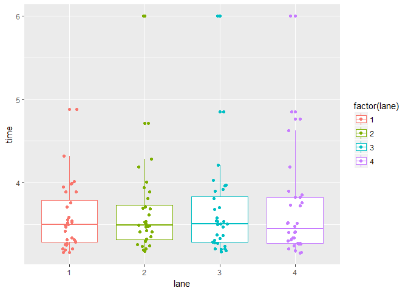

<!-- 
---
layout: post
title: "Pinewood Derby"
date: 2017-10-28
---
-->
One of my colleagues has his own [Pinewood
Derby](https://en.wikipedia.org/wiki/Pinewood_derby) track. He picked it
up when he was teaching high school science, and used Pinewood Derby as
a science activity. He also uses and electronic timing system that keeps
produces all of the race data.

<!--excerpt-->
Let's explore!

[Get the
data](https://github.com/nutterb/nutterb.github.com/blob/master/public/_posts/PinewoodDerby.Rdata)

    library(dplyr)
    library(ggplot2)
    library(lme4)
    library(magrittr)
    library(pixiedust)

    options(pixiedust_print_method = "markdown")

    load("PinewoodDerby.Rdata")

    PinewoodDerby <- 
      PinewoodDerby %>% 
      mutate(car = factor(car))

The data contains the following columns:

-   `car` an ID number for the derby car.
-   `racer` Initials of the racer. `car` and `racer` have a one-to-one
    relationship; either one could be used as an identifer for
    the other.
-   `group` A description of the racing group.
-   `round` Round of competition. Always `1` in these data.
-   `heat` The heat number. Each heat consists of four cars. Each car
    runs once on each lane.
-   `lane` The lane number on which the car was run.
-   `time` The number of seconds to cross the finish line.
-   `speed` The speed of the vehicle. I'm not sure of the units on this.
-   `place` The finish place within the heat.

The first question that was brought up when discussing these data with
my colleagues was whether the lanes themselves are biased. That is, is
there evidence that any lane runs faster than another. A simple boxplot
(below) doesn't seem to show much evidence of this.

    library(ggplot2)
    ggplot(data = PinewoodDerby,
           mapping = aes(x = lane,
                         y = time,
                         colour = factor(lane))) + 
      geom_boxplot() + 
      geom_jitter(width = 0.1)

We can use a couple of different models to confirm this finding. A
simple approach is to use a linear model.

    fit_lm <- 
      lm(time ~ lane, 
        data = PinewoodDerby) 

    fit_lm %>% 
      dust() %>% 
      sprinkle(pad = 4)

<table>
<thead>
<tr class="header">
<th align="left">term</th>
<th align="right">estimate</th>
<th align="right">std.error</th>
<th align="right">statistic</th>
<th align="right">p.value</th>
</tr>
</thead>
<tbody>
<tr class="odd">
<td align="left">(Intercept)</td>
<td align="right">3.5709875</td>
<td align="right">0.0953411</td>
<td align="right">37.4548689</td>
<td align="right">0</td>
</tr>
<tr class="even">
<td align="left">lane2</td>
<td align="right">0.0813344</td>
<td align="right">0.1348326</td>
<td align="right">0.6032247</td>
<td align="right">0.547461</td>
</tr>
<tr class="odd">
<td align="left">lane3</td>
<td align="right">0.0736063</td>
<td align="right">0.1348326</td>
<td align="right">0.5459082</td>
<td align="right">0.5861098</td>
</tr>
<tr class="even">
<td align="left">lane4</td>
<td align="right">0.1048</td>
<td align="right">0.1348326</td>
<td align="right">0.7772599</td>
<td align="right">0.4384858</td>
</tr>
</tbody>
</table>

That's a pretty high p-value, which doesn't give us much reason to
believe that the lanes are different. Another approach we could take is
to use a mixed effects model. This would let us declare each car as a
random factor.

    fit_me <- 
       lmer(time ~ (1|car) + lane,
            data = PinewoodDerby) 

    fit_me %>% 
       dust() 

<table>
<thead>
<tr class="header">
<th align="left">term</th>
<th align="right">estimate</th>
<th align="right">std.error</th>
<th align="right">statistic</th>
<th align="left">group</th>
</tr>
</thead>
<tbody>
<tr class="odd">
<td align="left">(Intercept)</td>
<td align="right">3.5709875</td>
<td align="right">0.0953411</td>
<td align="right">37.4548684</td>
<td align="left">fixed</td>
</tr>
<tr class="even">
<td align="left">lane2</td>
<td align="right">0.0813344</td>
<td align="right">0.08009</td>
<td align="right">1.0155376</td>
<td align="left">fixed</td>
</tr>
<tr class="odd">
<td align="left">lane3</td>
<td align="right">0.0736063</td>
<td align="right">0.08009</td>
<td align="right">0.9190446</td>
<td align="left">fixed</td>
</tr>
<tr class="even">
<td align="left">lane4</td>
<td align="right">0.1048</td>
<td align="right">0.08009</td>
<td align="right">1.3085285</td>
<td align="left">fixed</td>
</tr>
<tr class="odd">
<td align="left">sd_(Intercept).car</td>
<td align="right">0.4338744</td>
<td align="right">NA</td>
<td align="right">NA</td>
<td align="left">car</td>
</tr>
<tr class="even">
<td align="left">sd_Observation.Residual</td>
<td align="right">0.3203599</td>
<td align="right">NA</td>
<td align="right">NA</td>
<td align="left">Residual</td>
</tr>
</tbody>
</table>

What's interesting between these two models is that the coefficients
didn't change at all between them, but the t-statistics are a bit larger
in the mixed model. The mixed model thinks there's a stronger case for
the lanes being a little bit different. It makes this conclusion by
recognizing that there are differences between the cars themselves. In
fact, we can get very similar results with the linear model

    fit_lm_alt <- lm(time ~ car + lane, 
                     data = PinewoodDerby)

Unfortunately, this model requires 34 degrees of freedom (because of so
many cars), when there are only 128 observations in the data set.
Including that many degrees of freedom could overfit the model, and
probably isn't a good idea. Then again, stuffing all of that data into
one degree of freedom as a random effect is kind of squishy, but it's
quite the same theoretical adjustment and statisticians seem to be
comfortable letting that slide.

The next question of interest is whether the mixed effects model really
has any advantage over the linear model. We can compare the AIC values
between the two models. This shows the linear model has an AIC of
211.1232236, and the mixed effects model of 161.2001289. The mixed
effects model appears to have a slightly better fit, though it's hard to
tell if this is a meaningful increase. For that we'd have to look at a
likelihood ratio test, which is a topic for another day.

Ultimately, which model has a better fit isn't of much use to us, as
both models suggest that there isn't a significant difference between
lanes. If they had produced different conclusions, it would be
worthwhile to explore further. For now, we can be confident that race
results are being determined by which lane the cars run on.
