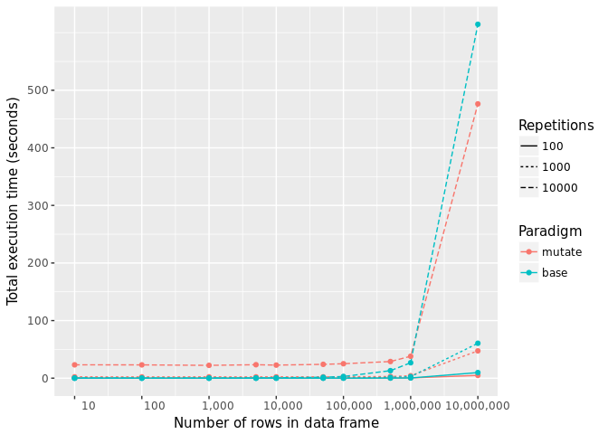
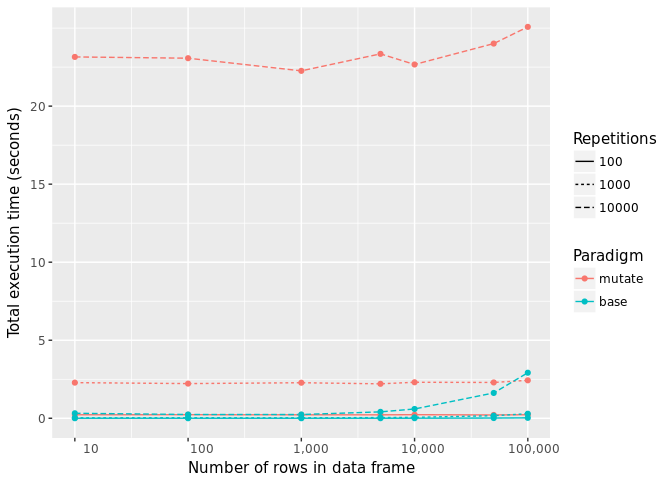
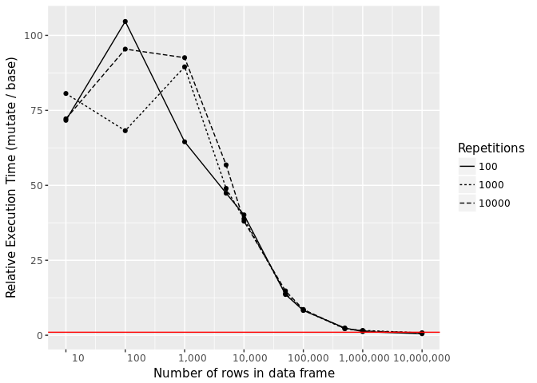

<!-- 
---
layout: post
title: "Tidyversing for the sake of Tidyversing"
date: 2017-11-15
---
-->
I've recently developed a hobby for refactoring `tidy` methods from the
`broom` package. (We have yet to see how long that will last, but it's a
good exercise). `broom` is a part of the tidyverse, and as you might
expect, it tends to draw in use of some of the tidyverse tools. While
reviewing one of these functions, I cam across a very peculiar [line of
code](https://github.com/tidyverse/broom/blob/master/R/felm_tidiers.R#L73):

<!--excerpt-->
    ret <- mutate(ret, N = NA, comp = NA)

As I read that, I wondered what exactly is the benefit of using `mutate`
to assign to columns of missing values. So as I am prone to doing, I
spend way too much time looking at this.

Let's consider the `base` R code for accomplishing the same task:

    ret$N <- NA
    ret$comp <- NA

In the tidyverse version, we use 37 characters (plus seven more if you
inclue `dplyr::` since this is in a package function). For base, we use
26. So I haven't saved myself key strokes, and I don't think the intent
is any more clear using `mutate`.

Is there a speed advantage? Let's take a look.

    library(microbenchmark)
    library(dplyr)

    ## 
    ## Attaching package: 'dplyr'

    ## The following objects are masked from 'package:stats':
    ## 
    ##     filter, lag

    ## The following objects are masked from 'package:base':
    ## 
    ##     intersect, setdiff, setequal, union

    X <- mtcars
    (m1 <- 
        microbenchmark(
          dplyr = mutate(X, new1 = NA, new2 = NA),
          base = {
            X$new1 <- NA
            X$new2 <- NA
          }
        )
    )

    ## Unit: microseconds
    ##   expr      min       lq       mean   median        uq       max neval
    ##  dplyr 2670.282 2743.064 3408.62241 2804.841 2894.6175 28099.125   100
    ##   base   16.877   19.503   28.90744   34.150   36.7075    51.399   100

Nope, it turns out that `mutate` is 82.13 times slower than using the
base R approach. This observation comes with the obvious caveat that
we're measuring time in microseconds here. This isn't really a big deal,
right?

Well that depends. How many times are we going to do this. `broom`'s
`tidy` methods can be used to get easy-to-work-with data from model
objects. And if you are doing, for example, a bootstrap procedure where
you're producing 10,000 model objects, the execution time for these two
statements becomes 28.048405 seconds using `mutate` vs 0.3415 seconds
using `base`. It turns out those microseconds start to add up.

So far, this is only dealing with a data frame with 32 rows. I was also
curious if perhaps `mutate` scaled better than `base`. The following
function looks at both the number of iterations and the size of the data
frame to evaluate performance between the two approaches.

What we find from the image below is that `base` is faster than `mutate`
for this purpose so long as the data frame has fewer than about a
million rows. At that point, `mutate` appears to gain the advantage.

    library(reshape2)
    Conditions <- 
      expand.grid(size = c(10, 100, 1000, 5000, 10000, 
                           50000, 100000, 500000, 1000000, 
                           10000000),
                  reps = c(100, 1000, 10000))

    Trial <- 
      mapply(
        FUN = function(size, reps){
          X <- data.frame(id = seq_len(size))
          m <- 
            microbenchmark(
              mutate = mutate(X, new1 = NA, new2 = NA),
              base = {
                X$new1 <- NA
                X$new2 <- NA
              }
            )
          m <- summary(m, unit = "ms")
          m$size = size
          m$reps = reps
          m
        },
        size = Conditions$size,
        reps = Conditions$reps,
        SIMPLIFY = FALSE
      ) %>% 
      bind_rows() %>% 
      mutate(total_execution = median * reps)

    TrialCompare <- 
      Trial %>% 
      select(expr, size, reps, total_execution) %>% 
      dcast(size + reps ~ expr, 
            value.var = "total_execution") %>% 
      mutate(relative_time = mutate / base)

    library(ggplot2)

    break_at <- log(unique(Trial$size), 10)
    break_at <- break_at[break_at %% 1 == 0]

    ggplot(data = Trial,
           mapping = aes(x = log(size, 10),
                         y = total_execution,
                         color = factor(expr),
                         linetype = factor(reps))) + 
      geom_line() + 
      geom_point() + 
      scale_x_continuous(breaks = break_at,
                         labels = format(10 ^ break_at,
                                         big.mark = ",",
                                         scientific = FALSE)) + 
      scale_y_continuous(breaks = c(0, 1e5, 2e5, 3e5, 4e5, 5e5),
                         labels = c(0, 1e5, 2e5, 3e5, 4e5, 5e5) / 1000) + 
      xlab("Number of rows in data frame") + 
      ylab("Total execution time (seconds)") + 
      labs(linetype = "Repetitions",
           color = "Paradigm")

If we focus on the data frames with 100,000 rows of fewer, we can better
see the difference at "small" data frames, where 10,000 repetitions
takes about 20 seconds to process with `mutate` for pretty much any size
data frame. `base`, on the other hand, only takes about 2.5 seconds by
the time we reach data frames of this size. Otherwise, the total
execution time is close to zero.

    ggplot(data = filter(Trial, size <= 100000),
             mapping = aes(x = log(size, 10),
                           y = total_execution,
                           color = factor(expr),
                           linetype = factor(reps))) + 
      geom_line() + 
      geom_point() + 
      scale_x_continuous(breaks = break_at,
                         labels = format(10 ^ break_at,
                                         big.mark = ",",
                                         scientific = FALSE)) + 
      scale_y_continuous(breaks = seq(0, 20000, by = 5000),
                         labels = seq(0, 20000, by = 5000) / 1000) +
      xlab("Number of rows in data frame") + 
      ylab("Total execution time (seconds)") + 
      labs(linetype = "Repetitions",
           color = "Paradigm")

For completeness, the following figure depicts relative execution time.
I won't spend much time interpreting it.

So what's the moral of the story? There are tradeoffs when we decide on
which tool to use. While I appear to be making the case here that the
`base` R approach is superior for the task of adding new columns of
`NA`s (kind of a fringe thing, I know), you should also notice that I
used `tidyverse` tools to help me develop the results and display them.
It turns out that for the purpose of constructing the analysis, I felt
like the `tidyverse` tools were a better tool to reason with and
organize my approach to gathering and interpreting the data. The key
issue is that this was largely interactive, and it will likely only ever
be run a handful of times. Any potential tradeoffs in execution time
aren't likely to have a big impact on my day.

On the other hand, when I am programming a function--especially if I
expect that the function may be used in some kind of replicated
manner--I may consider different tool sets that sacrifice a *little* bit
of readability to gain efficiency. And why not? It's in a function, so I
don't have to read it often anyway!

    break_at <- log(unique(TrialCompare$size), 10)
    break_at <- break_at[break_at %% 1 == 0]

    ggplot(data = TrialCompare,
           mapping = aes(x = log(size, 10),
                         y = relative_time,
                         linetype = factor(reps))) + 
      geom_line() + 
      geom_point() + 
      scale_x_continuous(breaks = break_at,
                         labels = format(10 ^ break_at,
                                         big.mark = ",",
                                         scientific = FALSE)) + 
      xlab("Number of rows in data frame") + 
      ylab("Relative Execution Time (mutate / base)") + 
      labs(linetype = "Repetitions") + 
      geom_hline(yintercept = 1.0,
                 color = "red")

